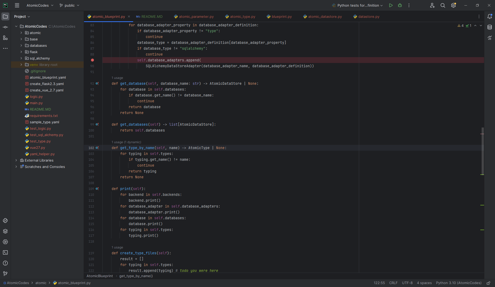

# The Atomic Codes

A full featured AI scaff older that takes recipes and can create them in any language.
Create projects with multiple databases (for read/write for example) and multiple back ends.
Accelerate your seniors and eliminate junior busy work.



## How does it work?

Atomic codes takes an [atomic blueprint](atomic_blueprint.yaml) which defines the project. It is read in and the hand
written AI writes the project. This is much more powerful than single line questions to chatgpt. It is more of a
senior/architect level tool where as others are for juniors who simply wish to skip googling stackover flow.

```yaml

sample_blueprint:
  types:
    - 'sample_type.yaml' # a file (or just type it here lul, it's yaml)
    # programmable interface with as string ofc
  # order matters, so define backends first. define multiple if you want each
  # handling a different part of the services
  database:
    - orm1:
        sqlite:
          file: 'dingdong.db'
  database_adapter:
    - orm1_adapter:
        type: 'sqlalchemy'
        database: 'orm1'
  backend:
    - flask1: #we can create multiple back end
        type: 'flask23'
        endpoints:
          - 'create_flask2.3.yaml' #the def file
  frontend: #same create multiple front ends that are agnostic
    - vue27:
        definition: 'create_vue_2.7.yaml'
        services:
          create:
            backend: 'flask23' #which back end this page should talk to for create


```

In our sample here we link to a defined type [sample_type.yaml](sample_type.yaml). Then we define a database, sqlite and
it's connection string.
Then we tell it what adapter we want to use.

Then in `backend` we define what backends we want to use. We can use multiple here. In this example a simple flask one
is created. [create_flask2.3.yaml](create_flask2.3.yaml) But you could
chose `asp.net`, `django`, `express`, `nest`, `next`, `servicestack` etc.

Let's have a look at create_flask

```yaml

endpoints:
  create: #this is just the name
    incoming_type: 'some_type' # what type defines what this endpoint expects as parameters
    verb: 'POST'
    validate: #validate the data  .. note these two order can be switched to taste
    authenticate: #authenticate the user
    database_action: # we're gonna dozies an insert, in this case sqlalchemy
      orm1:
        insert:
          incoming_type: #we are inserting the type properties
            exclude:
              identity: #but not the id fields if any were sent along

```

The end point (s) definitions are simple. You tell it a very, what types it expects, what to do (`validate` based on the
type definition), check user `authentication`, aka this is a protected call, and finally that you want to take the user
and do a `database_action` on the previously defined `orm1` and that you want it to be an insert of the `incoming_type`
variable.

Congrats, in writing 2 minutes of yaml you just saved your self 3 hours.

Then in `frontend` we define what front end to use. `React`, `vue`, `sveltte` or for true devs who hate
themselves `jquery and html`

# Done

That's it. After defining what you want it to do in a declarative manner the AI takes care of the rest. No calls to
chatgpt or other services, the AI is hand written by coders with 20+ years of experience and delivers well tested, validated,
and extensible code. 

Suddenly decide that you don't want to do this in flask? Simply change out the back end and database adapter.

Coming soon